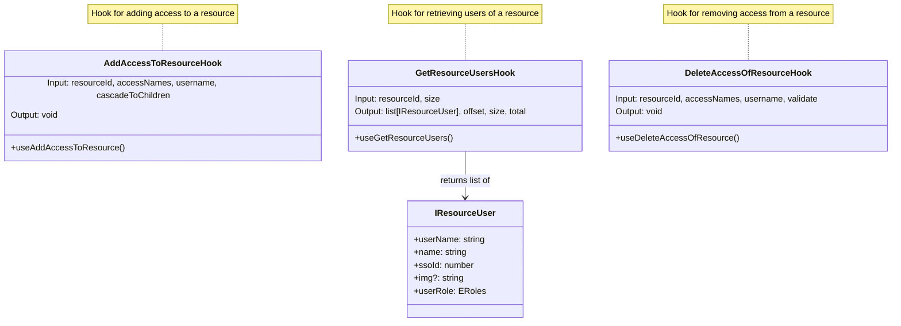

```mermaid
%% Access Management Service
%% This diagram shows all hooks related to access management functionality:
%% - Adding access to resources
%% - Getting users of a resource
%% - Deleting access from resources

classDiagram
    class AddAccessToResourceHook {
        +useAddAccessToResource()
        Input: resourceId, accessNames, username, cascadeToChildren
        Output: void
    }

    class GetResourceUsersHook {
        +useGetResourceUsers()
        Input: resourceId, size
        Output: list[IResourceUser], offset, size, total
    }

    class DeleteAccessOfResourceHook {
        +useDeleteAccessOfResource()
        Input: resourceId, accessNames, username, validate
        Output: void
    }

    class IResourceUser {
        +userName: string
        +name: string
        +ssoId: number
        +img?: string
        +userRole: ERoles
    }

    GetResourceUsersHook --> IResourceUser : returns list of

    note for AddAccessToResourceHook "Hook for adding access to a resource"
    note for GetResourceUsersHook "Hook for retrieving users of a resource"
    note for DeleteAccessOfResourceHook "Hook for removing access from a resource"
``` 