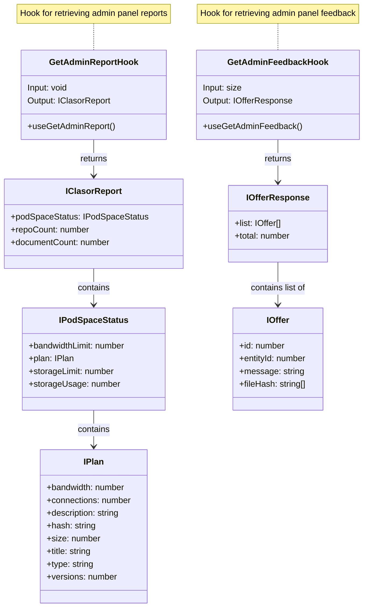

```mermaid
%% Admin Service
%% This diagram shows all hooks related to admin functionality:
%% - Getting admin reports
%% - Getting admin feedback

classDiagram
    class GetAdminReportHook {
        +useGetAdminReport()
        Input: void
        Output: IClasorReport
    }

    class GetAdminFeedbackHook {
        +useGetAdminFeedback()
        Input: size
        Output: IOfferResponse
    }

    class IClasorReport {
        +podSpaceStatus: IPodSpaceStatus
        +repoCount: number
        +documentCount: number
    }

    class IPodSpaceStatus {
        +bandwidthLimit: number
        +plan: IPlan
        +storageLimit: number
        +storageUsage: number
    }

    class IPlan {
        +bandwidth: number
        +connections: number
        +description: string
        +hash: string
        +size: number
        +title: string
        +type: string
        +versions: number
    }

    class IOfferResponse {
        +list: IOffer[]
        +total: number
    }

    class IOffer {
        +id: number
        +entityId: number
        +message: string
        +fileHash: string[]
    }

    GetAdminReportHook --> IClasorReport : returns
    IClasorReport --> IPodSpaceStatus : contains
    IPodSpaceStatus --> IPlan : contains

    GetAdminFeedbackHook --> IOfferResponse : returns
    IOfferResponse --> IOffer : contains list of

    note for GetAdminReportHook "Hook for retrieving admin panel reports"
    note for GetAdminFeedbackHook "Hook for retrieving admin panel feedback"
``` 