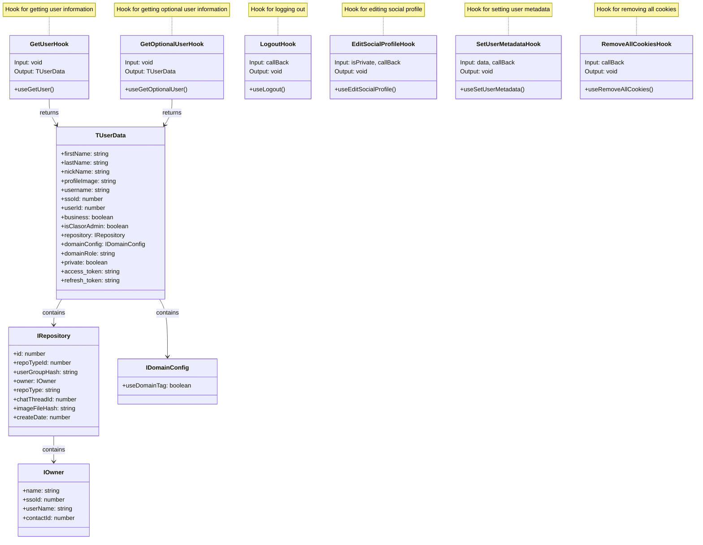

```mermaid
%% Auth Service
%% This diagram shows all hooks related to authentication functionality:
%% - Getting user info
%% - Logging out
%% - Managing user profile
%% - Managing cookies

classDiagram
    %% Query Hooks
    class GetUserHook {
        +useGetUser()
        Input: void
        Output: TUserData
    }

    class GetOptionalUserHook {
        +useGetOptionalUser()
        Input: void
        Output: TUserData
    }

    %% Mutation Hooks
    class LogoutHook {
        +useLogout()
        Input: callBack
        Output: void
    }

    class EditSocialProfileHook {
        +useEditSocialProfile()
        Input: isPrivate, callBack
        Output: void
    }

    class SetUserMetadataHook {
        +useSetUserMetadata()
        Input: data, callBack
        Output: void
    }

    class RemoveAllCookiesHook {
        +useRemoveAllCookies()
        Input: callBack
        Output: void
    }

    %% Data Models
    class TUserData {
        +firstName: string
        +lastName: string
        +nickName: string
        +profileImage: string
        +username: string
        +ssoId: number
        +userId: number
        +business: boolean
        +isClasorAdmin: boolean
        +repository: IRepository
        +domainConfig: IDomainConfig
        +domainRole: string
        +private: boolean
        +access_token: string
        +refresh_token: string
    }

    class IRepository {
        +id: number
        +repoTypeId: number
        +userGroupHash: string
        +owner: IOwner
        +repoType: string
        +chatThreadId: number
        +imageFileHash: string
        +createDate: number
    }

    class IOwner {
        +name: string
        +ssoId: number
        +userName: string
        +contactId: number
    }

    class IDomainConfig {
        +useDomainTag: boolean
    }

    %% Relationships
    GetUserHook --> TUserData : returns
    GetOptionalUserHook --> TUserData : returns
    TUserData --> IRepository : contains
    TUserData --> IDomainConfig : contains
    IRepository --> IOwner : contains

    %% Notes
    note for GetUserHook "Hook for getting user information"
    note for GetOptionalUserHook "Hook for getting optional user information"
    note for LogoutHook "Hook for logging out"
    note for EditSocialProfileHook "Hook for editing social profile"
    note for SetUserMetadataHook "Hook for setting user metadata"
    note for RemoveAllCookiesHook "Hook for removing all cookies"
``` 