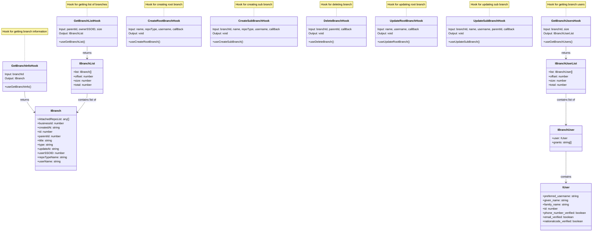

```mermaid
%% Branch Service
%% This diagram shows all hooks related to branch functionality:
%% - Getting branch information
%% - Managing branches (create, update, delete)
%% - Managing branch users

classDiagram
    %% Query Hooks
    class GetBranchInfoHook {
        +useGetBranchInfo()
        Input: branchId
        Output: IBranch
    }

    class GetBranchListHook {
        +useGetBranchList()
        Input: parentId, ownerSSOID, size
        Output: IBranchList
    }

    class GetBranchUsersHook {
        +useGetBranchUsers()
        Input: branchId, size
        Output: IBranchUserList
    }

    %% Mutation Hooks
    class CreateRootBranchHook {
        +useCreateRootBranch()
        Input: name, repoType, username, callBack
        Output: void
    }

    class CreateSubBranchHook {
        +useCreateSubBranch()
        Input: branchId, name, repoType, username, callBack
        Output: void
    }

    class DeleteBranchHook {
        +useDeleteBranch()
        Input: branchId, parentId, callBack
        Output: void
    }

    class UpdateRootBranchHook {
        +useUpdateRootBranch()
        Input: name, username, callBack
        Output: void
    }

    class UpdateSubBranchHook {
        +useUpdateSubBranch()
        Input: branchId, name, username, parentId, callBack
        Output: void
    }

    %% Data Models
    class IBranch {
        +AttachedRepoList: any[]
        +businessId: number
        +createdAt: string
        +id: number
        +parentId: number
        +title: string
        +type: string
        +updateAt: string
        +userSSOID: number
        +repoTypeName: string
        +userName: string
    }

    class IBranchList {
        +list: IBranch[]
        +offset: number
        +size: number
        +total: number
    }

    class IBranchUser {
        +user: IUser
        +grants: string[]
    }

    class IUser {
        +preferred_username: string
        +given_name: string
        +family_name: string
        +id: number
        +phone_number_verified: boolean
        +email_verified: boolean
        +nationalcode_verified: boolean
    }

    class IBranchUserList {
        +list: IBranchUser[]
        +offset: number
        +size: number
        +total: number
    }

    %% Relationships
    GetBranchInfoHook --> IBranch : returns
    GetBranchListHook --> IBranchList : returns
    GetBranchUsersHook --> IBranchUserList : returns
    IBranchList --> IBranch : contains list of
    IBranchUserList --> IBranchUser : contains list of
    IBranchUser --> IUser : contains

    %% Notes
    note for GetBranchInfoHook "Hook for getting branch information"
    note for GetBranchListHook "Hook for getting list of branches"
    note for GetBranchUsersHook "Hook for getting branch users"
    note for CreateRootBranchHook "Hook for creating root branch"
    note for CreateSubBranchHook "Hook for creating sub branch"
    note for DeleteBranchHook "Hook for deleting branch"
    note for UpdateRootBranchHook "Hook for updating root branch"
    note for UpdateSubBranchHook "Hook for updating sub branch"
``` 