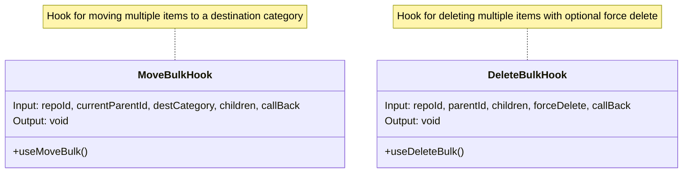

```mermaid
%% Bulk Service
%% This diagram shows all hooks related to bulk operations:
%% - Moving multiple items
%% - Deleting multiple items

classDiagram
    class MoveBulkHook {
        +useMoveBulk()
        Input: repoId, currentParentId, destCategory, children, callBack
        Output: void
    }

    class DeleteBulkHook {
        +useDeleteBulk()
        Input: repoId, parentId, children, forceDelete, callBack
        Output: void
    }

    note for MoveBulkHook "Hook for moving multiple items to a destination category"
    note for DeleteBulkHook "Hook for deleting multiple items with optional force delete"
``` 