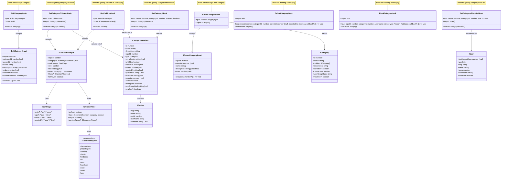

```mermaid
%% Category Service
%% This diagram shows all hooks related to category functionality

classDiagram
    %% Input Interfaces
    class IGetChildrenInput {
        +repoId: number
        +categoryId: number | undefined | null
        +sortParams: ISortProps
        +size: number
        +title?: string | null
        +type?: "category" | "document"
        +filters?: IChildrenFilter | null
        +forMove?: boolean
    }

    class ISortProps {
        +order?: "asc" | "desc"
        +type?: "asc" | "desc"
        +name?: "asc" | "desc"
        +createdAt?: "asc" | "desc"
    }

    class IChildrenFilter {
        +default: boolean
        +type: document: boolean, category: boolean
        +tagIds: number[]
        +contentTypes?: EDocumentTypes[]
    }

    class IEditCategoryInput {
        +repoId: number
        +categoryId: number | null
        +parentId: number | null
        +name: string
        +description: string | undefined
        +order: number | null
        +isHidden: boolean
        +currentParentId: number | null
        +callBack?: () => void
    }

    class ICreateCategoryInput {
        +repoId: number
        +parentId: number | null
        +name: string
        +description: string | undefined
        +order: number | null
        +onSuccessHandler?: () => void
    }

    %% Hooks
    class GetCategoryHook {
        Input: repoId: number, categoryId: number, enabled: boolean
        +useGetCategory()
        Output: ICategoryMetadata
    }

    class GetCategoryChildrenHook {
        Input: IGetChildrenInput
        +useGetCategoryChildren()
        Output: ICategoryMetadata[]
    }

    class GetChildrenHook {
        Input: IGetChildrenInput
        +useGetChildren()
        Output: ICategoryMetadata[]
    }

    class CreateCategoryHook {
        Input: ICreateCategoryInput
        Output: ICategory
    }

    class EditCategoryHook {
        Input: IEditCategoryInput
        +useEditCategory()
        Output: void
    }

    class DeleteCategoryHook {
        Input: repoId: number, categoryId: number, parentId: number | null, forceDelete: boolean, callBack?: () => void
        +useDeleteCategory()
        Output: void
    }

    class BlockCategoryHook {
        Input: repoId: number, categoryId: number, username: string, type: "block" | "unblock", callBack?: () => void
        +useBlockCategory()
        Output: void
    }

    class GetCategoryBlocklistHook {
        Input: repoId: number, categoryId: number, size: number
        +useGetCategoryBlocklist()
        Output: IUser[]
    }

    %% Output Interfaces
    class ICategoryMetadata {
        +id: number
        +name: string
        +description: string
        +repoId: number
        +type: "category"
        +extraDetails: string | null
        +isHidden: boolean
        +creator: ICreator | null
        +order?: number | null
        +createdAt: string | null
        +updatedAt: string | null
        +deletedAt: string | null
        +parentId: number | null
        +active: boolean
        +isTemplate: boolean
        +userGroupHash: string | null
        +newOne?: boolean
    }

    class ICategory {
        +id: number
        +name: string
        +children: ICategory[]
        +description: string
        +parentId?: number
        +createDate: number
        +userGroupHash: string
        +newOne?: boolean
    }

    class ICreator {
        +img: string
        +name: string
        +ssoId: number
        +userName: string
        +contactId: string | null
    }

    class IUser {
        +lastAccessDate: number | null
        +userInfo:
            +img: string
            +name: string
            +ssoId: number
            +userName: string
        +userRole: ERoles
    }

    class EDocumentTypes {
        <<enumeration>>
        stakeholders
        projectreport
        meeting
        classic
        feedback
        file
        word
        flowchart
        excel
        board
        latex
    }

    %% Relationships
    IGetChildrenInput --> ISortProps : uses
    IGetChildrenInput --> IChildrenFilter : uses
    IChildrenFilter --> EDocumentTypes : uses

    GetCategoryHook --> ICategoryMetadata : returns
    GetCategoryChildrenHook --> IGetChildrenInput : accepts
    GetCategoryChildrenHook --> ICategoryMetadata : returns list of
    GetChildrenHook --> IGetChildrenInput : accepts
    GetChildrenHook --> ICategoryMetadata : returns list of
    CreateCategoryHook --> ICreateCategoryInput : accepts
    CreateCategoryHook --> ICategory : returns
    EditCategoryHook --> IEditCategoryInput : accepts
    ICategoryMetadata --> ICreator : contains
    GetCategoryBlocklistHook --> IUser : returns list of

    %% Notes
    note for GetCategoryHook "Hook for getting category information"
    note for GetCategoryChildrenHook "Hook for getting category children"
    note for GetChildrenHook "Hook for getting children of a category"
    note for CreateCategoryHook "Hook for creating a new category"
    note for EditCategoryHook "Hook for editing a category"
    note for DeleteCategoryHook "Hook for deleting a category"
    note for BlockCategoryHook "Hook for blocking a category"
    note for GetCategoryBlocklistHook "Hook for getting category block list"
```
