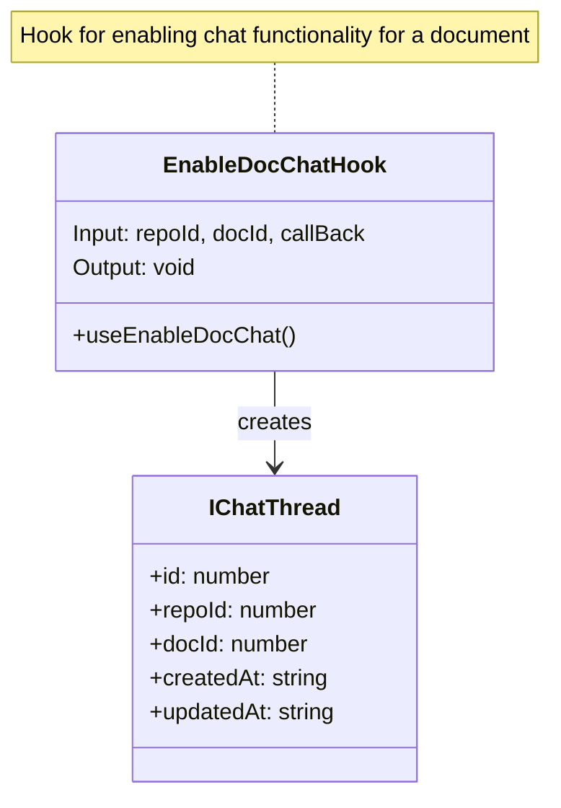

```mermaid
%% Chat Service
%% This diagram shows all hooks related to chat functionality:
%% - Enabling chat for documents
%% - Managing chat threads

classDiagram
    %% Query Hooks
    class EnableDocChatHook {
        +useEnableDocChat()
        Input: repoId, docId, callBack
        Output: void
    }

    %% Data Models
    class IChatThread {
        +id: number
        +repoId: number
        +docId: number
        +createdAt: string
        +updatedAt: string
    }

    %% Relationships
    EnableDocChatHook --> IChatThread : creates

    %% Notes
    note for EnableDocChatHook "Hook for enabling chat functionality for a document"
``` 