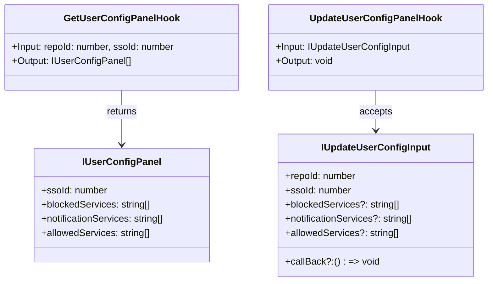

```mermaid
classDiagram
    class GetUserConfigPanelHook {
        +Input: repoId: number, ssoId: number
        +Output: IUserConfigPanel[]
    }

    class UpdateUserConfigPanelHook {
        +Input: IUpdateUserConfigInput
        +Output: void
    }

    class IUserConfigPanel {
        +ssoId: number
        +blockedServices: string[]
        +notificationServices: string[]
        +allowedServices: string[]
    }

    class IUpdateUserConfigInput {
        +repoId: number
        +ssoId: number
        +blockedServices?: string[]
        +notificationServices?: string[]
        +allowedServices?: string[]
        +callBack?: () => void
    }

    GetUserConfigPanelHook --> IUserConfigPanel : returns
    UpdateUserConfigPanelHook --> IUpdateUserConfigInput : accepts
``` 