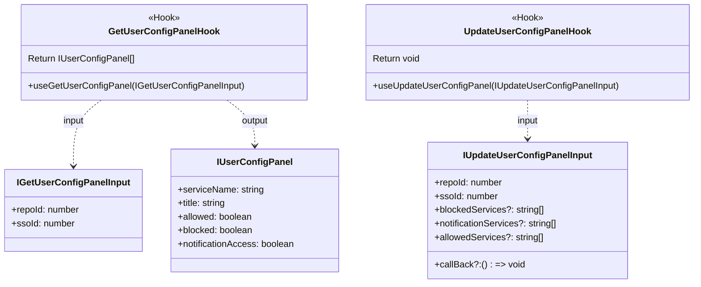

```mermaid
classDiagram
    %% Hooks
    class GetUserConfigPanelHook {
        <<Hook>>
        +useGetUserConfigPanel(IGetUserConfigPanelInput)
        Return IUserConfigPanel[]
    }

    class UpdateUserConfigPanelHook {
        <<Hook>>
        +useUpdateUserConfigPanel(IUpdateUserConfigPanelInput)
        Return void
    }

    %% Input Interfaces
    class IGetUserConfigPanelInput {
        +repoId: number
        +ssoId: number
    }

    class IUpdateUserConfigPanelInput {
        +repoId: number
        +ssoId: number
        +blockedServices?: string[]
        +notificationServices?: string[]
        +allowedServices?: string[]
        +callBack?: () => void
    }

    %% Output Interfaces
    class IUserConfigPanel {
        +serviceName: string
        +title: string
        +allowed: boolean
        +blocked: boolean
        +notificationAccess: boolean
    }

    %% Relationships
    GetUserConfigPanelHook ..> IGetUserConfigPanelInput : input
    GetUserConfigPanelHook ..> IUserConfigPanel : output
    UpdateUserConfigPanelHook ..> IUpdateUserConfigPanelInput : input
``` 