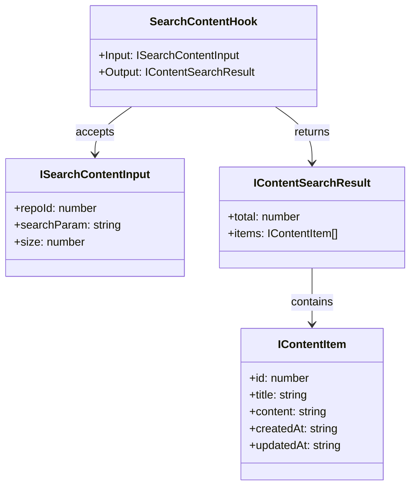

```mermaid
classDiagram
    class SearchContentHook {
        +Input: ISearchContentInput
        +Output: IContentSearchResult
    }

    class ISearchContentInput {
        +repoId: number
        +searchParam: string
        +size: number
    }

    class IContentSearchResult {
        +total: number
        +items: IContentItem[]
    }

    class IContentItem {
        +id: number
        +title: string
        +content: string
        +createdAt: string
        +updatedAt: string
    }

    SearchContentHook --> ISearchContentInput : accepts
    SearchContentHook --> IContentSearchResult : returns
    IContentSearchResult --> IContentItem : contains
``` 