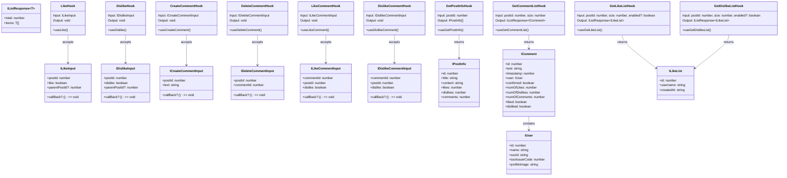

```mermaid
%% Core Service
%% This diagram shows all hooks related to core functionality

classDiagram
    %% Input Interfaces
    class ILikeInput {
        +postId: number
        +like: boolean
        +parentPostId?: number
        +callBack?: () => void
    }

    class IDislikeInput {
        +postId: number
        +dislike: boolean
        +parentPostId?: number
        +callBack?: () => void
    }

    class ICreateCommentInput {
        +postId: number
        +text: string
        +callBack?: () => void
    }

    class IDeleteCommentInput {
        +postId: number
        +commentId: number
        +callBack?: () => void
    }

    class ILikeCommentInput {
        +commentId: number
        +postId: number
        +dislike: boolean
        +callBack?: () => void
    }

    class IDislikeCommentInput {
        +commentId: number
        +postId: number
        +dislike: boolean
        +callBack?: () => void
    }

    %% Output Interfaces
    class IPostInfo {
        +id: number
        +title: string
        +content: string
        +likes: number
        +dislikes: number
        +comments: number
    }

    class IComment {
        +id: number
        +text: string
        +timestamp: number
        +user: IUser
        +confirmed: boolean
        +numOfLikes: number
        +numOfDislikes: number
        +numOfComments: number
        +liked: boolean
        +disliked: boolean
    }

    class IUser {
        +id: number
        +name: string
        +ssoId: string
        +ssoIssuerCode: number
        +profileImage: string
    }

    class ILikeList {
        +id: number
        +username: string
        +createdAt: string
    }

    class IListResponse~T~ {
        +total: number
        +items: T[]
    }

    %% Hooks
    class GetPostInfoHook {
        Input: postId: number
        +useGetPostInfo()
        Output: IPostInfo[]
    }

    class LikeHook {
        Input: ILikeInput
        +useLike()
        Output: void
    }

    class DislikeHook {
        Input: IDislikeInput
        +useDislike()
        Output: void
    }

    class GetLikeListHook {
        Input: postId: number, size: number, enabled?: boolean
        +useGetLikeList()
        Output: IListResponse~ILikeList~
    }

    class GetDislikeListHook {
        Input: postId: number, size: number, enabled?: boolean
        +useGetDislikeList()
        Output: IListResponse~ILikeList~
    }

    class CreateCommentHook {
        Input: ICreateCommentInput
        +useCreateComment()
        Output: void
    }

    class DeleteCommentHook {
        Input: IDeleteCommentInput
        +useDeleteComment()
        Output: void
    }

    class GetCommentListHook {
        Input: postId: number, size: number
        +useGetCommentList()
        Output: IListResponse~IComment~
    }

    class LikeCommentHook {
        Input: ILikeCommentInput
        +useLikeComment()
        Output: void
    }

    class DislikeCommentHook {
        Input: IDislikeCommentInput
        +useDislikeComment()
        Output: void
    }

    %% Relationships
    GetPostInfoHook --> IPostInfo : returns
    LikeHook --> ILikeInput : accepts
    DislikeHook --> IDislikeInput : accepts
    GetLikeListHook --> ILikeList : returns
    GetDislikeListHook --> ILikeList : returns
    CreateCommentHook --> ICreateCommentInput : accepts
    DeleteCommentHook --> IDeleteCommentInput : accepts
    GetCommentListHook --> IComment : returns
    LikeCommentHook --> ILikeCommentInput : accepts
    DislikeCommentHook --> IDislikeCommentInput : accepts
    IComment --> IUser : contains
``` 