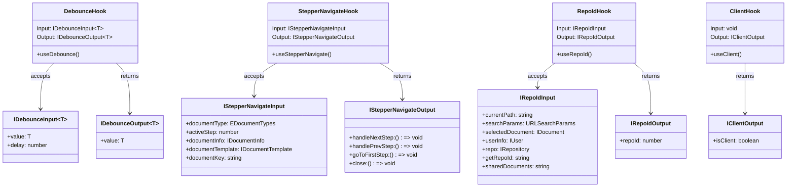

```mermaid
%% Custom Hooks Service
%% This diagram shows all custom hooks

classDiagram
    %% Input Interfaces
    class IDebounceInput~T~ {
        +value: T
        +delay: number
    }

    class IStepperNavigateInput {
        +documentType: EDocumentTypes
        +activeStep: number
        +documentInfo: IDocumentInfo
        +documentTemplate: IDocumentTemplate
        +documentKey: string
    }

    class IRepoIdInput {
        +currentPath: string
        +searchParams: URLSearchParams
        +selectedDocument: IDocument
        +userInfo: IUser
        +repo: IRepository
        +getRepoId: string
        +sharedDocuments: string
    }

    %% Output Interfaces
    class IDebounceOutput~T~ {
        +value: T
    }

    class IStepperNavigateOutput {
        +handleNextStep: () => void
        +handlePrevStep: () => void
        +goToFirstStep: () => void
        +close: () => void
    }

    class IRepoIdOutput {
        +repoId: number
    }

    class IClientOutput {
        +isClient: boolean
    }

    %% Hooks
    class DebounceHook {
        Input: IDebounceInput~T~
        +useDebounce()
        Output: IDebounceOutput~T~
    }

    class StepperNavigateHook {
        Input: IStepperNavigateInput
        +useStepperNavigate()
        Output: IStepperNavigateOutput
    }

    class RepoIdHook {
        Input: IRepoIdInput
        +useRepoId()
        Output: IRepoIdOutput
    }

    class ClientHook {
        Input: void
        +useClient()
        Output: IClientOutput
    }

    %% Relationships
    DebounceHook --> IDebounceInput~T~ : accepts
    DebounceHook --> IDebounceOutput~T~ : returns
    StepperNavigateHook --> IStepperNavigateInput : accepts
    StepperNavigateHook --> IStepperNavigateOutput : returns
    RepoIdHook --> IRepoIdInput : accepts
    RepoIdHook --> IRepoIdOutput : returns
    ClientHook --> IClientOutput : returns
``` 