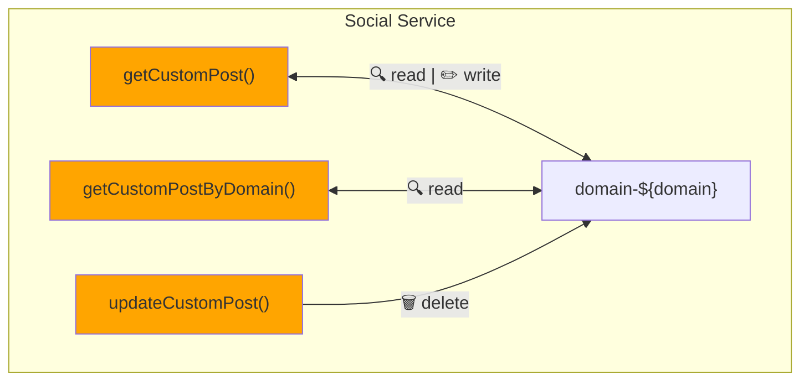

```mermaid
graph TD
    subgraph Social Service
        %% Redis Keys
        R1["`domain-${domain}`"]

        %% Functions that both read and write/delete - Orange
        RW1["`getCustomPost()`"]:::readwrite
        RW2["`getCustomPostByDomain()`"]:::readwrite
        RW3["`updateCustomPost()`"]:::readwrite

        %% Bidirectional connections with emojis
        RW1 <-->|"🔍 read | ✏️ write"| R1
        RW2 <-->|"🔍 read"| R1
        RW3 -->|"🗑️ delete"| R1
    end

    %% Styling
    classDef readwrite fill:#FFA500
```